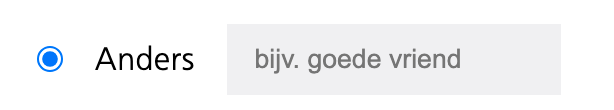
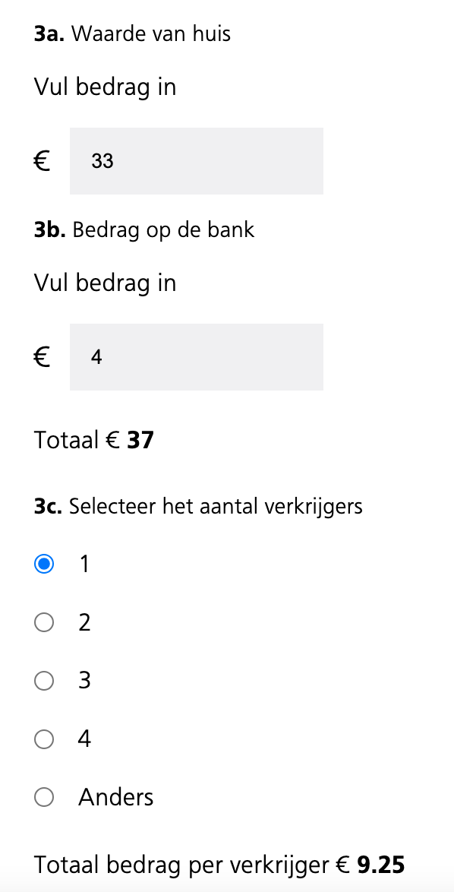

# Browser Tech | NS Formulier Aangifte
Browser Technologies NS formulier

**Week 1, eerste feedbacksessie en plan bespreken**
Vandaag hadden we de eerste feedbacksessie. Ik was eigenlijk al gelijk begonnen met het 'stylen van mijn website', en kreeg als feedback van Krijn dat ik misschien wat meer kon focusen op de functionaliteit van het formulier. Dit was goede feedback

**Week 2, woensdag 4 mrt**
Door de feedback van vorige week heb ik eigenlijk het hele formulier wat ik had verwijderd en ben ik opnieuw begonnen. Het doel wat ik had met opnieuw beginnen is om het formulier funcitoneel ook goed te laten werken. De styling ga ik later toepassen.

Wat ik vandaag heb geleerd door naar andere/docenten te kijken:
 - fieldsets
 - verschillende input types

 Nu maak ik gebruik van verschillende fieldsets. Ik ben er achter gekomen dat dit makkelijker is om te stylen. Ook snap ik de legend tag nu.

**Week 2, donderdag 5 mrt**
Ik had vandaag het idee om sommige extra vragen pas te tonen wanneer er op een button word gedrukt. Dit moest met Javascript. Uiteindelijk is dit me (met wat hulp van Jamie) gelukt. Hij heeft me geholpen om dit bij een vraag te doen, en ik heb zelf dezelfde functie op meerdere vragen gezet, waardoor ik de functie nu goed snap. Samen met krijn heb ik ervoor gezorgd dat de animatie ook soepel loopt, dus dat ie met een soort ease in- en uitklapt.

Update: de 'ease' animatie werkt niet meer en het is me tot op heden niet gelukt om deze werkend te krijgen

**Week 3, woensdag 12 mrt**
Vandaag ben ik verder gegaan met de volgende 2 fieldsets, ik wilde wel iets andere functionaliteiten dan in de eerste fieldset zodat ik niet 3 keer hetzelfde deed. Ik heb een functie toegevoegd waarbij je kunt kiezen wat de relatie is met de verkrijger. Hiervoor heb ik ook onderaan een vakje met 'anders' gemaakt, waarbij er een inputveld verschijnt als deze geselecteerd is. 

Het is me gelukt om dit alleen met CSS te doen door :has te gebruiken (eigenlijk :not(has:)), dus als javascript het niet doet, werkt dit nog steeds

code: 

:not(:has(#anders:checked)) #andersVerborgen,
:not(:has(#andersVerkrijger:checked)) #andersVerkrijger1 {
    display: none;
}

**Week 3, donderdag 13 mrt**
Vandaag ben ik vooral veel gaan stijlen, ik heb de titels allemaal dezelfde class gegeven zodat deze allemaal dezelfde styling hebben. Dit heb ik ook gedaan met de verschillende fieldsets. Ook heb ik de inpupts en buttons in een div gezet om deze mooi uit te lijnen met display: flex.

Ook ben ik vandaag op het idee gekomen om nog een berekening in mijn formulier te verwerken. Ik zag dit bij klasgenoten, zij hebben mij geinspireerd om dit ook te doen. Ik hoorde dat je de vragen ook een eigen draai mag geven, dus ik ben gegaan voor een optelsom. Deze input + deze input = dit. 

**Week 4, woensdag 19 mrt**
Deze dag was eigenlijk alles een beetje 'finetunen' en door mijn code heen gaan of er nog rare dingen in staan of slordigheden. Zo stonden er 2 fouten in mijn console en dat waren de fouten van het NS-font. Jamie heeft met mij mee gekeken en zag dat de fonts een spatie hadden waardoor ze niet werkten. Klein slordigheidsfoutje maar mijn formulier ziet er nu een stuk mooier uit. 

Ik had nog iets van tijd over dus ik zag de challange om nog een berekening toe te voegen: een breuk. Ik wil het totaalbedrag van de som delen door het aantal verkrijgers. Na veel zelf pielen is het me niet gelukt om het zonder hulp voor elkaar te krijgen. Ik ben vervolgens naar Jamie gegaan en hij heeft mij geholpen om de formule werkend te krijgen. Het is dus op de valreep alsnog gelukt om de extra berekening in mijn formulier te krijgen. Ook nog wat kleine design dingetjes opgeknapt en even gekeken of de responsiveness goed was. 

